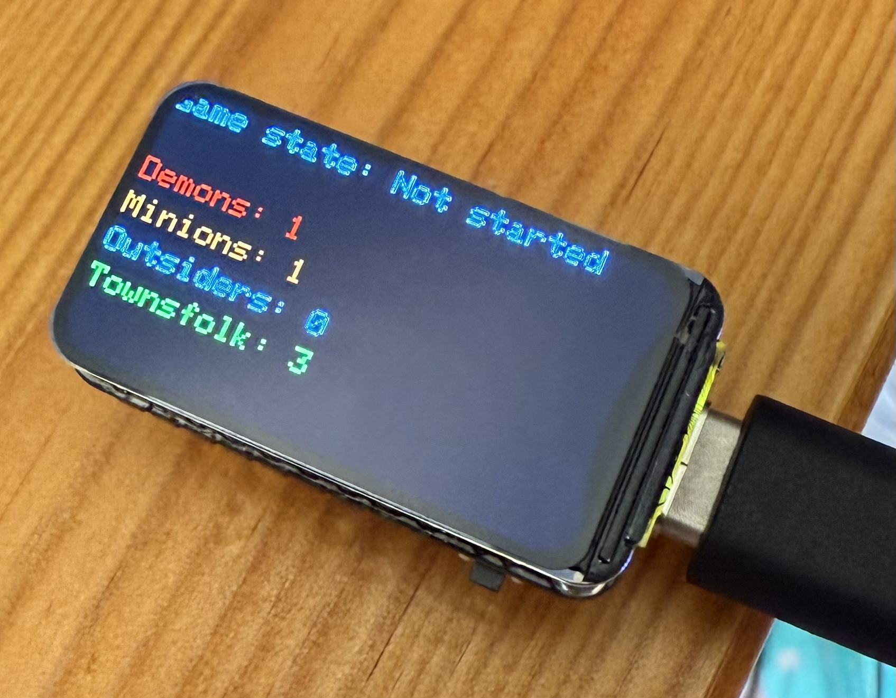
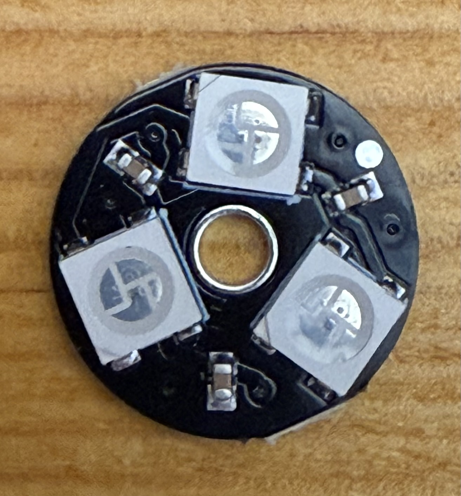
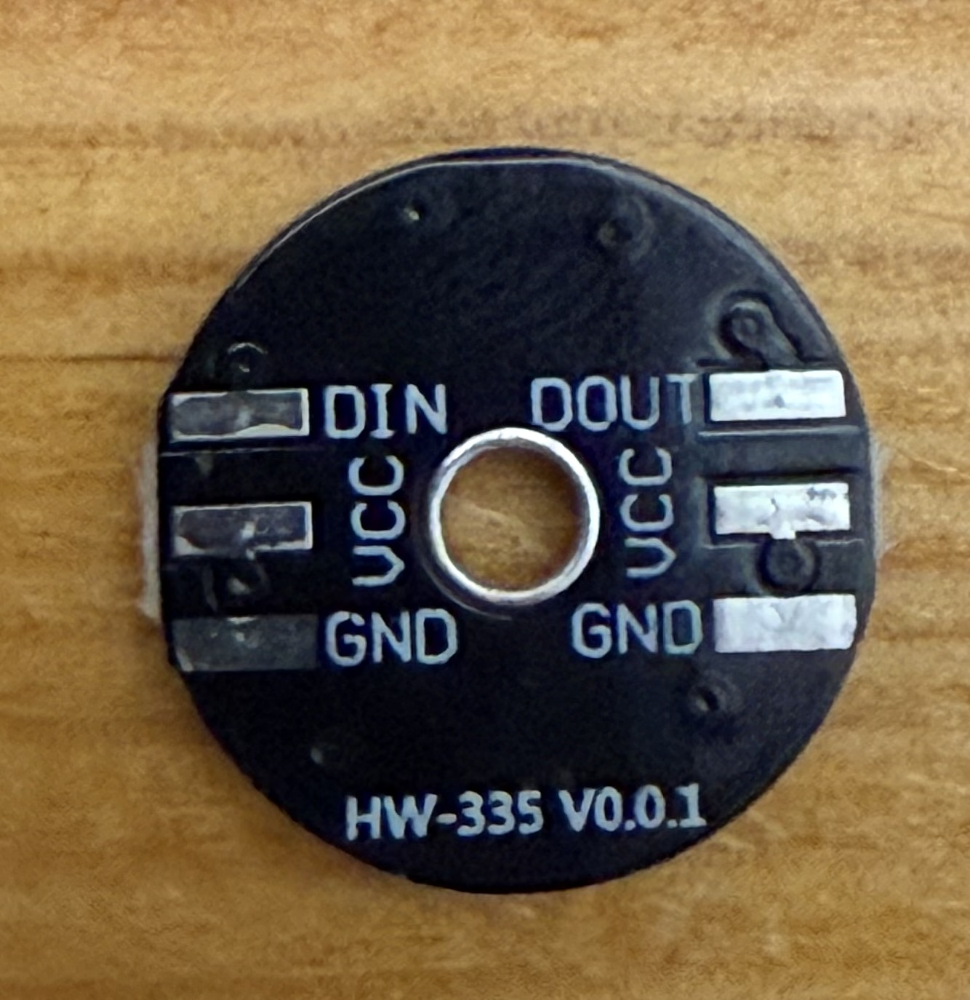
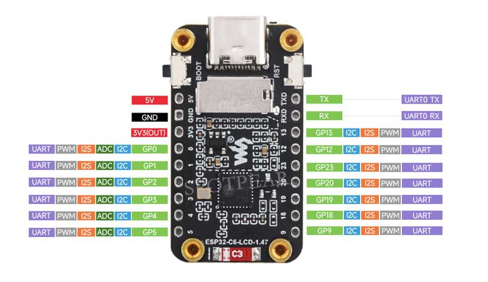
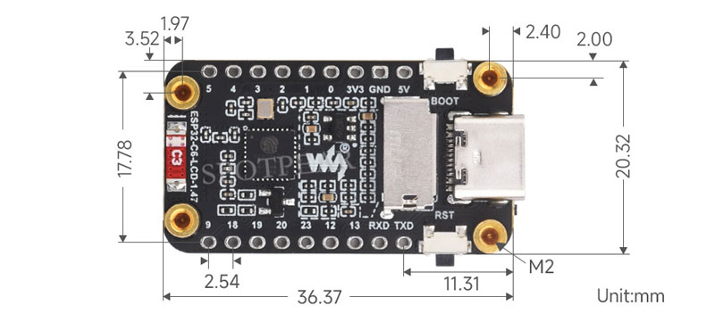
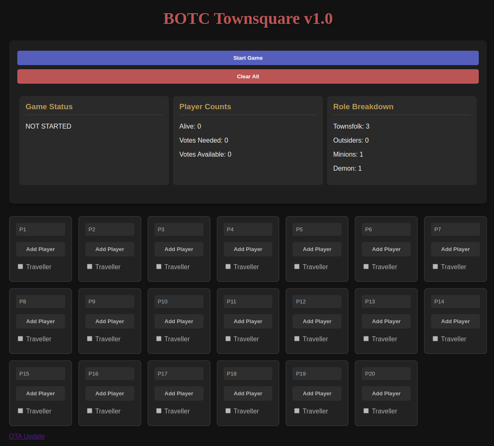

# Blood on the Clocktower Town Square Controller

## Overview
This project is an ESP32-C6 based controller for managing a physical town square for the social deduction game "Blood on the Clocktower". It uses a network of 3-LED rings (one ring per player) to visually represent player status in the game, along with a color LCD display and web interface for game management.

<table>
<tr>
<td colspan=2>

</td>
</tr>
<tr>
<td>


</td>
<td>


</td>
</tr>
</table>

## Hardware Components
- **ESP32-C6** microcontroller
- **ST7789 Color LCD Display** (172x320) with SPI interface
- **WS2812 RGB LED Rings** - 3-bit LED WS2812 5050 with integrated drivers (17mm diameter, 5V) - one ring per player, connected in a chain (up to 20 players supported)
- Power supply (5V recommended for stable LED operation)

## Features
- **LED Player Indicators**: Each player is represented by a 3-LED disk with colors indicating their game status:
  - Green: Alive player
  - Yellow: Alive traveller
  - Blue: Dead with voting token
  - Purple: Dead without voting token
  - Red/Blue: Game ended (Evil/Good win)
  
- **ST7789 Display**: Shows game status information including:
  - Game state (Not started, In progress, Game over)
  - Win condition (if game ended)
  - Role distribution (Townsfolk, Outsiders, Minions, Demon)
  
- **Web Interface**: Access via any browser connected to the same network
  - Responsive design that works on mobile devices
  - Real-time game state updates using AJAX
  - Player management (add/remove players, rename players)
  - Traveller status toggling
  - Game state control (start/end/reset game)
  
- **WiFi Setup**:
  - Automatic WiFi manager with fallback access point mode
  - Creates "Clocktower-Setup" network if unable to connect to saved WiFi
  
- **Persistent Storage**:
  - Game state saved to SPIFFS even after power loss
  - Stores player names, statuses, and traveller flags

## Setup Instructions

### First Boot
1. Power on the device
2. Connect to the "Clocktower-Setup" WiFi network from your phone or computer
3. Follow the portal instructions to connect the device to your local WiFi
4. Note the IP address displayed on the ST7789 screen

## Web Interface



### Web Interface Access
1. Connect to the same WiFi network as the device
2. Open a web browser and enter the IP address shown on the display
3. The Blood on the Clocktower town square interface will load

## Game Management

### Player Status Control
- Each player has their own card in the web interface
- Click the status button to cycle through player states:
  - Not in play → Alive → Dead with vote → Dead without vote → Not in play
- Check the "Traveller" box to mark a player as a traveller (yellow LED instead of green)
- Enter a name to assign a player name

### Game Controls
- **Start Game**: Begins the game and updates the role distribution
- **Good/Evil Wins**: Ends the game and triggers the winning team's light show
- **Reset Game**: Resets the game state without clearing player names
- **Clear All**: Completely resets all data including player names

### Role Calculation
The system automatically calculates the recommended role distribution based on the number of active players according to the official Blood on the Clocktower rules.

## Technical Notes

### LED Configuration
- Each player uses one 17mm WS2812 RGB LED Ring (3-bit LED WS2812 5050 with integrated drivers)
- The LED rings are connected in a chain (DATA OUT to DATA IN of the next ring)
- Default configuration supports up to 20 players (60 LEDs total, 3 per ring)
- Data pin is connected to GPIO3
- Operating voltage: 5V

### Circuit Diagram and Setup

#### Components Needed
- ESP32-C6 development board
- 20× WS2812 RGB LED Rings (17mm, 3-bit)
- Logic level shifter (3.3V to 5V)
- 5V power supply (minimum 2A recommended)
- 1000μF capacitor (10V or higher)
- 300-500Ω resistor
- 10kΩ pull-up resistor
- Optional: separate 3.3V regulator for ESP32

#### Circuit Setup
```
[Power Supply 5V] ----+---- [1000μF Capacitor] ---- [GND]
                      |
                      +---- [5V input for all LED Rings]
                      |
                      +---- [TXS0108E VB pin]
                      |
                      +---- [Optional 3.3V Regulator] ---- [ESP32-C6 3.3V] ---- [TXS0108E VA pin] ---- [TXS0108E OE pin]
                      
[ESP32-C6 GPIO3] ---- [TXS0108E A1 pin]
[TXS0108E B1 pin] ---- [300-500Ω Resistor] ---- [WS2812 Ring #1 DATA IN]
[WS2812 Ring #1 DATA OUT] ---- [WS2812 Ring #2 DATA IN]
... and so on for all rings ...

[ESP32-C6 GND] ---- [TXS0108E GND] ---- [LED Rings GND] ---- [Power Supply GND]
```

#### Level Shifter
Since the ESP32-C6 operates at 3.3V logic and the WS2812 LED rings require 5V logic signals, a level shifter is necessary:

**Recommended: TXS0108E Bi-Directional Level Shifter Module**
- Perfect for this application as it provides clean signal conversion
- Connect as follows:
  - VA pin to ESP32-C6 3.3V
  - VB pin to 5V power supply
  - GND to common ground
  - A1 pin to ESP32-C6 GPIO3
  - B1 pin to the first WS2812 LED ring's data input
  - OE pin to 3.3V (to enable the chip)
- The TXS0108E has 8 channels, so you can use the remaining channels for other signals if needed

Alternative options:
- 74HCT245 or 74AHCT125 ICs
- Simple single-channel level shifter using a BSS138 MOSFET

#### Power Considerations
- Each WS2812 LED can draw up to 60mA at full brightness (white)
- Total maximum current: 60 LED × 60mA = 3.6A theoretical maximum
- In practice, with color mixing and not all LEDs at full white:
  - Typical usage: ~1-2A for 20 rings
  - Recommended power supply: 5V 2A minimum, 5V 3A for reliability
- Use a capacitor (1000μF, 10V+) across power and ground near the first LED ring to filter power spikes
- For longer chains, consider injecting power at multiple points (every 7-10 rings)

#### Signal Integrity
- Add a 300-500Ω resistor between the level shifter output and the first LED ring's data input
- Keep data wires as short as possible
- For longer runs, use twisted pair wiring
- Consider adding a 10kΩ pull-up resistor from the data line to 5V

#### Safety Notes
- Never connect or disconnect LED rings while power is applied
- If using a shared power supply, ensure your 5V rail can handle the current
- For portable applications, add reverse polarity protection

### Display Configuration
- ST7789 172x320 display 
- Pins:
  - CS: GPIO14
  - DC: GPIO15
  - RST: GPIO21
  - MOSI: GPIO6
  - SCLK: GPIO7
  - BL (Backlight): GPIO22

### Customization
You can modify the following constants in the code to adapt to your setup:
- `NUM_PLAYERS`: Maximum number of players (default 20)
- `LEDS_PER_PLAYER`: LEDs per disk (default 3)
- Display colors and pin assignments

## Troubleshooting

### Common Issues
- If the device doesn't appear on the network, check the display for error messages
- If LEDs don't light up, verify power supply can handle the current requirements
- To factory reset, use the "Clear All" button in the web interface

### LED Ring Issues
- **First LED works but others don't**: Check data connections between rings
- **Random flickering**: 
  - Add or upgrade the capacitor near the power input (1000μF minimum)
  - Verify the level shifter is working correctly
  - Check for loose connections
- **Colors incorrect**: Verify the LED type in code (GRB vs RGB ordering)
- **Dim LEDs**: 
  - Check power supply voltage under load (should be 4.8V-5.2V)
  - Measure voltage at the furthest LED ring (voltage drop)
- **Data corruption**: 
  - Verify the 300-500Ω resistor is in place on the data line
  - Keep data wires away from noise sources
  - Try shorter or better quality wires

### Power Issues
- **LEDs draw too much current**: Set a brightness limit in the code (`FastLED.setBrightness()`)
- **ESP32 resets when LEDs activate**: Use separate power supplies or add more capacitors
- **Power supply overheating**: Upgrade to a higher rated power supply

## Credits
Designed for use with "Blood on the Clocktower" by The Pandemonium Institute

## License
This project is open source and available under the MIT license.
